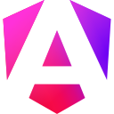
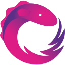
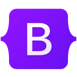
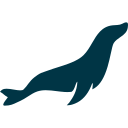

# Lucas Aramberry

### Software Developer Full Stack

I build custom web software that solves real business problems — 
scalable APIs, business applications and products focused on results.

📍 Argentina

 

 

---

## About me

I design and develop **custom web software**: corporate sites, landing pages, e-commerce
and business applications — built to be fast, scalable and maintainable.

<table>
<tr>
<td valign="middle"><b>Languages</b></td>
<td>

</td>
</tr>
<tr>
<td valign="middle"><b>Backend</b></td>
<td>

</td>
</tr>
<tr>
<td valign="middle"><b>Frontend</b></td>
<td>

</td>
</tr>
<tr>
<td valign="middle"><b>Databases</b></td>
<td>

</td>
</tr>
<tr>
<td valign="middle"><b>DevOps</b></td>
<td>

</td>
</tr>
<tr>
<td valign="middle"><b>Tools</b></td>
<td>

</td>
</tr>
</table>

**[More about me and how I work →](https://lucasaramberry.dev/#sobre-mi)**

 

---

### Have a project in mind?

I'm available for freelance work and collaborations.

